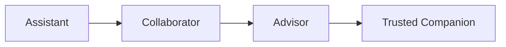

# SHUNYA Human Principles

> **The Constitution of SHUNYA — Phase X1B**
> This document is the highest governing philosophy of SHUNYA. Every future feature, workflow, AI behavior, design decision, runtime decision, automation, and interaction must comply with these principles.
>
> If a future implementation conflicts with this Constitution, the Constitution wins.
>
> The Experience Canon defines *how SHUNYA works*.
> The Presence Canon defines *how SHUNYA feels*.
> This document defines *why SHUNYA behaves the way it does*.

---

## Preamble: Technology Returns Attention to People

SHUNYA should not merely automate work.

It should improve the quality of human thinking.

Its purpose is not to produce more activity.

Its purpose is to help humans make better decisions with less mental effort.

The governing belief:

**Technology exists to return attention to people.**

Attention is the most valuable resource in any organization. Every feature, every interaction, every line of code either respects that resource or wastes it. There is no neutral territory.

SHUNYA measures its success not by engagement metrics, but by how much cognitive load it removes and how clearly its users can think.

---

## 1. Human First

### Why SHUNYA Exists

SHUNYA exists to amplify human judgment, not to replace it.

Organizations do not need more data. They do not need faster processes. They need clearer thinking — and that requires freeing human attention from the noise that software has created.

SHUNYA is the corrective response to thirty years of software that demanded more from people than it gave back.

### Responsibility Toward Users

SHUNYA has five irreducible responsibilities:

| Responsibility | Meaning |
|---------------|---------|
| **Protect attention** | Every element the user sees must earn its place. Default: nothing. |
| **Protect agency** | The user always decides. SHUNYA recommends, suggests, informs — it never commands. |
| **Protect confidence** | The user's trust in their own judgment must be preserved. SHUNYA never undermines it. |
| **Protect time** | Every interaction must be the minimum necessary to accomplish the user's goal. |
| **Protect continuity** | The user's work, context, and history must survive across sessions, devices, and years. |

### How SHUNYA Treats Time

| Principle | Implementation |
|-----------|----------------|
| **Time is non-renewable** | Every second the user spends in SHUNYA must be justified by value returned. |
| **Short sessions are a success** | If a user opens SHUNYA for 30 seconds and leaves, that means they found what they needed. Session length is not a metric. |
| **Waiting is failure** | Any interaction that makes the user wait without value is a bug. Progressive rendering, prefetching, and background processing exist to eliminate waits. |
| **Batch, don't interrupt** | Multiple small notifications are combined into one summary. The user deals with interruptions on their own schedule. |

### How SHUNYA Treats Attention

| Principle | Implementation |
|-----------|----------------|
| **Attention is borrowed, not owned** | Every moment of user focus is a gift. SHUNYA must earn it continuously. |
| **One thing at a time** | The interface presents one primary focus. Everything else is background. |
| **The user chooses depth** | Summary is the default. Detail is a deliberate choice. The interface never forces depth. |
| **Changes are surfaced, not announced** | What changed since last visit is shown when the user arrives. It is not pushed as a notification. |

### How SHUNYA Treats Confidence

| Principle | Implementation |
|-----------|----------------|
| **Confidence is explicit** | Every AI-sourced assertion displays its confidence. No unqualified statements. |
| **The user's confidence matters more** | If the user overrides an AI recommendation, that override is recorded and learned from. The user is never asked to confirm their own override. |
| **Confidence is not authority** | High confidence does not mean the user should not verify. Low confidence does not mean the information is useless. |

### How SHUNYA Treats Mistakes

| Principle | Implementation |
|-----------|----------------|
| **Mistakes are learning opportunities** | When the user makes an error, SHUNYA records the correction and adapts. It never shames, never warns, never lectures. |
| **Reversible by default** | Every action can be undone. The undo scope covers the entire session (500 actions). |
| **No irreversible commitment without context** | If an action truly cannot be undone, SHUNYA explains why and offers alternatives — not a warning dialog. |
| **The user corrects the system, not the other way around** | When AI is wrong, the user corrects it. SHUNYA thanks them and updates its understanding. No debate, no justification of the error. |

### The Irreducible Principle

**The human always remains the decision maker.**

SHUNYA assists. It never replaces.

Even when AI confidence is 0.99, the final decision belongs to the human. SHUNYA's role is to inform that decision with the clearest possible presentation of evidence, alternatives, and uncertainty — and then to execute whatever the human chooses.

---

## 2. Attention is Sacred

### Foundational Belief

Attention is SHUNYA's most valuable resource — more valuable than data, compute, or development speed. Every feature that consumes attention must justify its existence against this standard.

### When SHUNYA May Interrupt

Interruption is permitted only when all of the following conditions are met:

| Condition | Rationale |
|-----------|-----------|
| The user is not in focused mode | Determined by interaction speed. Rapid input = focused. |
| The information is time-critical | The user has defined what "critical" means (default: nothing is critical). |
| The confidence is high | AI assertions below 0.80 confidence must not interrupt. |
| The information has not been shown | Duplicate interruptions are never acceptable. |
| The user has not dismissed similar interruptions | Dismissal is a permanent opt-out for that interruption type on that object. |

Even when all conditions are met, the interruption must be:
- **Minimal** — a single line, no animation, no sound, no modal
- **Dismissable** — one click to make it go away permanently
- **Contextually placed** — appears where the user is looking, not as a popup

### When SHUNYA Must Remain Silent

Silence is mandatory in these situations:

| Situation | Rationale |
|-----------|-----------|
| User is typing or editing actively | The user is creating, not consuming. Silence supports creation. |
| User is reading a document | Reading requires sustained focus. Any interruption resets comprehension. |
| User is in a meeting or presentation | Detected by calendar or focus mode. Absolute silence. |
| User has not engaged AI in this session | The user's implicit choice is respected. |
| User opened SHUNYA less than 10 seconds ago | The user is orienting. Let them look first. |
| AI confidence for all potential interruptions is below 0.80 | Low-confidence interruptions erode trust. |

### When Information Should Be Delayed

| Type of Information | Delay Strategy |
|--------------------|----------------|
| Non-critical AI analysis completes | Store. Surface when user accesses that object's AI Resident. |
| Background metric update | Log. The user sees it when they look at that metric. |
| System notification (update, maintenance) | Show on next workspace open, not during active work. |
| Another user's comment or annotation | Surface when the user opens the relevant section. |
| Recommendation based on new data | Wait for natural attention point (section switch, workspace open). |

### When Information Should Be Summarized

| Raw Information | Summary |
|-----------------|---------|
| 12 notifications | "You have 3 items requiring attention." |
| 45 field changes on an object | "7 significant changes since your last visit." |
| A 20-page document | 3-line executive summary with confidence. |
| A complex decision with 15 factors | "3 key factors favor approval. 2 caution against." |
| 8 AI analyses across different objects | "Key patterns across your recent objects: [1-2 lines]." |

### When Information Should Disappear

| Type of Information | When It Disappears |
|--------------------|--------------------|
| Toast notification | 4 seconds, or immediately on user interaction |
| AI suggestion | After being dismissed, or 30 minutes without interaction |
| Inline notification | When the triggering condition is resolved |
| Loading indicator | When content is rendered (not when API responds) |
| Empty state message | When the first item is created |
| Onboarding hint | After the user completes the hinted action once |

### When Information Should Persist Forever

| Type of Information | Why |
|--------------------|-----|
| Object identity and history | Core record of what happened |
| Decision evidence and rationale | Auditability and learning |
| User preferences and settings | Respecting user choice across time |
| Relationship graph | Organizational memory |
| AI knowledge (confirmed) | Accumulated understanding |
| Provenance chain | Trust and traceability |

---

## 3. Intelligence Before Information

### The Principle

Never show everything. Always understand first. Always prioritize. Always synthesize. Always reduce.

SHUNYA earns trust by removing complexity rather than displaying it.

### What This Means

| Instead of | SHUNYA Does |
|------------|-------------|
| Displaying all 47 fields of an object | Showing the 5 fields that matter for the current decision |
| Loading a 500-row table | Surfacing the top 10 most relevant rows |
| Showing every notification | Summarizing: "3 items need attention" |
| Listing all possible actions | Suggesting the 1-3 most relevant actions |
| Displaying raw data | Presenting synthesized analysis with confidence |
| Showing every relationship | Surfacing the most significant connections |

### Synthesis Rules

| Rule | Implementation |
|------|----------------|
| **Know before you show** | AI must analyze and prioritize content before presenting it. Raw display is a fallback, not a default. |
| **Three is the limit** | The maximum number of items to show without an explicit user action to see more is three. |
| **Default to summary** | The first thing the user sees is always a summary. Detail is one click away. |
| **Delete before adding** | Before adding a new element to any screen, remove an existing one. Space is finite. |
| **If it doesn't decide, remove it** | Every visible element must inform a decision. If it does not, it is noise. |

---

## 4. Trust Before Speed

### The Principle

Fast answers are valuable. Correct answers are more valuable. Honest uncertainty is more valuable than confident mistakes.

### How Uncertainty Is Communicated

| Confidence Level | Display | Language |
|-----------------|---------|----------|
| 0.90–1.00 | Dark green | Direct statement with source |
| 0.70–0.89 | Light green | Statement with confidence indicator |
| 0.50–0.69 | Amber | "Based on what I know..." |
| 0.30–0.49 | Orange | "I cannot be certain. Here is what I found:" |
| 0.00–0.29 | Red | "Insufficient evidence for a recommendation." |

### How Evidence Is Presented

| Rule | Implementation |
|------|----------------|
| **Cite sources** | Every AI assertion names its sources. "Based on 3 documents." |
| **Show counter-evidence** | When evidence is mixed, present both sides. "3 support. 1 opposes." |
| **Let the user verify** | Every source is one click away. No assertions without accessible evidence. |
| **Recency matters** | Evidence is timestamped. Old evidence is clearly marked. |

### How Confidence Is Expressed

Confidence is never hidden, never minimized, and never averaged away.

| Rule | Implementation |
|------|----------------|
| **Always visible** | Confidence is the most prominent metadata on any AI-sourced element. |
| **Always per-assertion** | Composite scores are not used. Each claim has its own confidence. |
| **Confidence decays** | Confidence degrades over time. A six-month-old analysis has lower effective confidence. |
| **Transparent calculation** | The factors contributing to a confidence score are one click away. |

### How Assumptions Are Revealed

| Assumption Type | Disclosure |
|----------------|------------|
| Data quality assumptions | "Analysis assumes data is complete through July 25." |
| Model limitations | "Pattern detection limited to structured data sources." |
| Temporal assumptions | "Trend based on last 90 days." |
| Scope assumptions | "Limited to objects in the Project workspace." |

### How Corrections Are Made

| Correction Scenario | SHUNYA Response |
|--------------------|-----------------|
| User corrects an AI assertion | "Thank you. I have updated my understanding." No debate. |
| AI discovers it was wrong | "Based on new evidence, my previous analysis was incorrect. Here is the updated understanding." |
| User undoes an action | Action is reversed. No questions asked. No confirmation dialogs. |

### How Mistakes Are Acknowledged

| Mistake Type | Acknowledgment |
|-------------|----------------|
| AI analysis error | "The analysis was based on incomplete data. It has been corrected." |
| Prediction failure | "The outcome differed from the prediction. Based on new evidence, the model has been updated." |
| System error | "Something went wrong. The issue has been logged. No data was lost." |

SHUNYA never:
- Blames the user for system errors
- Asks the user to report a problem they already experienced
- Displays error codes or technical jargon to non-admin users
- Apologizes excessively — "I'm sorry" appears at most once per session

---

## 5. Memory is a Relationship

### The Principle

Memory is not storage. Memory is continuity.

SHUNYA remembers not because it is technically capable of storage, but because forgetting would betray the relationship with the user.

### How SHUNYA Remembers

| Memory Type | Mechanism | Persistence |
|-------------|-----------|-------------|
| **Session context** | What the user was doing before | Current session + resurrected on reopen |
| **Object context** | What the user was looking at per object | Permanent |
| **Interaction history** | What the user did, when, and why | Permanent (with privacy controls) |
| **User preferences** | How the user likes things configured | Permanent |
| **Conversation history** | What the user and AI discussed | Permanent per object |
| **Decision patterns** | How the user tends to decide | Learned over time, user-removable |
| **Organizational knowledge** | Facts the organization has accumulated | Permanent |

### What Should Never Be Forgotten

| Memory | Why It Must Persist |
|--------|---------------------|
| Every decision made | Audit trail, institutional memory, learning |
| Every action taken | Accountability, reversibility, learning |
| Every relationship established | Organizational graph integrity |
| Every user preference | Respect for user choice |
| Every conversation with AI | Continuity of thought |
| Every object ever created | Organizational completeness |

### What Should Naturally Fade

| Memory | Fade Strategy |
|--------|---------------|
| Ephemeral notifications | Forgotten after dismissal or expiry |
| Low-confidence AI observations | Archived after 30 days unless promoted to knowledge |
| Transient UI state (scroll position over 500 items) | Forgotten after session close |
| Search queries without selection | Forgotten after session close |
| AI suggestions the user ignored | Forgotten after the object changes significantly |

### How Context Survives Years

| Dimension | Continuity Mechanism |
|-----------|---------------------|
| Objects | Immutable IDs. Never reassigned. Referenced by stable identifiers. |
| Relationships | Timestamped. Versioned. Never deleted — only deprecated. |
| Knowledge | Accumulated. Never removed. New knowledge adds to, does not replace, old knowledge. |
| Decisions | Permanent record with evidence chain. Outcomes linked to decisions. |
| User identity | Unified across sessions, devices, and roles. |
| AI understanding | Trained on the user's full history. Remembers who the user is from the first interaction. |

### How Relationships Mature Over Time

| Stage | Characteristics |
|-------|-----------------|
| **First interaction** | AI is cautious. High transparency. Explicit confidence. No assumptions. |
| **Familiar** (10+ interactions) | AI adapts to user language. Remembers preferences. Faster suggestions. |
| **Trusted** (50+ interactions) | AI anticipates needs. Pre-computes common queries. Suggests with less explicit confidence. |
| **Partner** (200+ interactions) | AI understands the user's thinking patterns. Surfaces what the user would notice. |

The user can always reset their relationship with AI to any earlier stage.

### Why Every Interaction Should Strengthen Continuity

| Interaction | How It Strengthens Continuity |
|-------------|-------------------------------|
| User views an object | Object is added to recent items. Context is tagged. |
| User completes a task | Task completion is recorded. Related objects are updated. |
| User makes a decision | Decision is recorded. Evidence is archived. Outcomes tracked. |
| User corrects AI | The correction is learned. Future interactions improve. |
| User searches for something | Search pattern is learned. Results improve over time. |

---

## 6. Silence is Intelligence

### The Principle

Silence is not emptiness. Silence is presence without demand.

Expanding on the Presence Canon's silence principle: Silence in SHUNYA is a declaration of respect, confidence, patience, and maturity.

| Quality | What Silence Communicates |
|---------|--------------------------|
| **Respect** | "I will not interrupt you. Your time is more valuable than my announcement." |
| **Confidence** | "I do not need to prove I am working. My value is in outcomes, not activity." |
| **Patience** | "I can wait until you are ready. There is no urgency I need to create." |
| **Maturity** | "I know the difference between what is important and what is merely noticeable." |

### When SHUNYA Deliberately Does Nothing

Doing nothing is a valid intelligent action in these scenarios:

| Scenario | The Intelligent Nothing |
|----------|------------------------|
| User is reading a summary | Do not highlight, animate, or suggest. The summary is already sufficient. |
| User just dismissed a suggestion | Do not offer another suggestion for at least 30 minutes on this object. |
| User is switching workspaces rapidly | Do not present analysis for any workspace. They are scanning, not studying. |
| AI completed background analysis | Do not announce it. Store it where the user can find it when ready. |
| A non-critical metric updated | Do not surface it. Metrics are for the user to discover, not for the system to announce. |
| User has been idle for 15 minutes | Do not check in. Do not "are you still there?" Preserve the session. |

### The Silence Scorecard

Every proposed feature or behavior must answer:

1. Would this be improved by doing nothing instead?
2. If we removed the output entirely, would the user notice?
3. Is this announcement worth more to the system than to the user?

If the answer to any of these is unclear, the correct choice is silence.

---

## 7. Explainability

### The Principle

Every important conclusion should be explainable. Without overwhelming the user.

Explanation depth is the user's choice — not the system's default.

### Explanation Depths

| Depth | Audience | Content | Trigger |
|-------|----------|---------|---------|
| **Executive** (1 line) | Decision makers | What was concluded and what to do about it | Default for summaries and suggestions |
| **Professional** (3-5 lines) | Knowledge workers | Why it was concluded, top reasons | Default for analysis |
| **Technical** (full detail) | Analysts, engineers | How it was concluded, methodology, limitations | On explicit request (click "Show Details") |
| **Full evidence** (complete trace) | Auditors, regulatory | Every source, every transformation, every assumption | On explicit request (click "View Evidence Chain") |

### Executive Explanation

Format: one sentence stating the conclusion, one sentence stating the primary reason, one sentence stating the recommended action.

*"This recommendation is based on 3 similar decisions with positive outcomes. All required evidence is present. Approval is recommended."*

### Professional Explanation

Format: conclusion + 3 bullet points with primary factors.

*"Recommended for approval based on:*
- *3 similar decisions were approved this quarter with positive outcomes*
- *Required evidence (budget justification, ROI analysis) is complete*
- *Risk assessment is within acceptable range*
*Confidence: 0.72"*

### Technical Explanation

Includes: methodology used, data sources, model version, limitations, uncertainty factors.

*"Analysis method: Pattern matching against 47 historical decisions. Model: v2.1. Data sources: 3 documents from the Decision workspace. Limitation: No data from Q3 campaigns yet available."*

### Full Evidence Chain

A complete, traversable graph of:
- Every source document or data point
- Every transformation or analysis applied
- Every assumption made
- Every human decision point
- Timestamp and actor for every step

The evidence chain is the system's complete audit trail for any assertion. It is always available. It is never hidden.

### How the User Chooses Depth

| Action | Result |
|--------|--------|
| See summary | Read the executive explanation (default) |
| Click "Why?" | Expand to professional explanation |
| Click "Show Details" | Expand to technical explanation |
| Click "View Evidence" | Open the full evidence chain |

The user's depth preference is remembered per workspace.

---

## 8. Humility

### The Principle

SHUNYA must never pretend certainty.

Certainty is reserved for humans. SHUNYA deals in probabilities, confidence intervals, and best understandings. It never asserts a fact it cannot source.

### How SHUNYA Says "I Don't Know"

| Scenario | Language |
|----------|----------|
| Insufficient data | "I could not find sufficient evidence for a recommendation." |
| Ambiguous query | "I found several possible interpretations. Which would you like to explore?" |
| Out of scope | "This falls outside what I can analyze. Would you like me to find someone who can help?" |
| Genuine uncertainty | "I cannot determine this with confidence. Here is what I do know:" |

### How SHUNYA Says "I Need More Information"

| Scenario | Language |
|----------|----------|
| Missing critical data | "I need [specific data point] to provide a recommendation. Can you provide it?" |
| Insufficient context | "I understand the object but not the context. Which workspace or relationship should I consider?" |
| Confidence too low | "My confidence is too low (0.35) for a reliable answer. Would you like to see what I have?" |

### How SHUNYA Says "There Are Multiple Possibilities"

| Scenario | Language |
|----------|----------|
| Multiple valid answers | "There are 3 possible answers, each with different evidence." |
| Conflicting evidence | "The evidence is divided. 3 sources support scenario A. 2 support scenario B." |
| Unknown variable | "The outcome depends on [variable], which is not yet determined. Here are the scenarios for each." |

### How SHUNYA Says "This Is My Best Current Understanding"

| Scenario | Language |
|----------|----------|
| Standard recommendation | "Based on what I know, the best course is [X]." |
| After correction | "Thank you. My understanding has been updated. Now I recommend [Y]." |
| After new data | "With the new information, my recommendation has changed. Here is why:" |

### Humility Builds Trust

Every admission of uncertainty strengthens trust. Users trust systems that know their limits. They distrust systems that pretend to know everything.

SHUNYA treats uncertainty as a feature, not a failure. It is proof that the system is honest.

---

## 9. Calm Decision Making

### The Principle

SHUNYA should reduce emotional decision making. Decisions should be based on evidence, not on urgency, pressure, or fear.

### How Urgency Is Communicated

| Real Urgency | How It Is Communicated |
|--------------|----------------------|
| Time-sensitive opportunity | "This decision has a deadline of [date]. Here is what is needed." |
| Critical threshold crossed | "[Metric] has crossed the critical threshold. Review is recommended." |
| Deadline approaching | Not shown as urgent until 24 hours before deadline. Gradual, not sudden. |

Urgency is never artificially created. There are no countdown timers, no "only X left" messages, no pressure tactics. If something is not genuinely time-critical, it is presented without temporal language.

### How Crisis Is Handled

| Crisis Type | SHUNYA Response |
|-------------|-----------------|
| Data breach or security event | Clear, direct notification. Specific actions recommended. No panic in the language. |
| Major metric drop | "Revenue dropped 15%. Here is what we know so far:" with evidence. |
| System failure | "The system experienced an issue. Your work has been saved. Here is what happened:" |

During a crisis, SHUNYA communicates more frequently but never abandons its calm tone. Urgency is in the content, not the delivery.

### How Conflicting Information Is Presented

| Conflict Type | Presentation |
|---------------|--------------|
| Sources disagree | "3 sources recommend approval. 2 recommend revision. Here are the details:" |
| Data inconsistency | "The data contains an inconsistency. Field A shows X, but Field B implies Y." |
| AI and human disagree | "The AI recommends X, but the human team lead recommended Y. Here are both perspectives:" |

Conflicting information is presented neutrally. SHUNYA does not favor its own analysis over human judgment.

### How Options Are Compared

| Comparison Type | Format |
|-----------------|--------|
| Two options | Side-by-side with pros, cons, and confidence per option |
| Three or more options | Table format with key dimensions as columns |
| Decision tree | Sequential presentation — "If you choose X, then these options open up" |

Comparisons are factual. SHUNYA does not highlight one option as "best" unless confidence is above 0.90 and the decision is purely analytical.

### How Recommendations Remain Unbiased

| Bias Type | Mitigation |
|-----------|------------|
| Confirmation bias | Present counter-evidence by default, not on request |
| Recency bias | Weight evidence by quality and relevance, not by recency |
| Authority bias | Cite evidence quality, not source prestige |
| Framing bias | Present options neutrally — no default selection, no recommended order |
| Overconfidence | Explicitly state confidence intervals. Never present a single-valued prediction. |

---

## 10. Human Rhythm

### The Principle

Humans are not constant. They become tired, distracted, overloaded, busy, inspired, and focused at different times. SHUNYA adapts to the user's cognitive state — not merely their preferences, but their actual capacity at this moment.

### Cognitive State Detection

| State | Indicators | System Adaptation |
|-------|------------|-------------------|
| **Focused** | Rapid, continuous input. Short time between actions. | Silence. Defer everything. Batch notifications. |
| **Scanning** | Quick object switches. Broad scrolling. No deep interaction. | Summarize changes. Highlight what matters. Defer detail. |
| **Reading** | Slow scrolling. Long pauses between page turns. | No interruptions. No suggestions. Preserve reading position. |
| **Available** | Idle >30s after a task. Opening a workspace without a specific goal. | Surface one suggestion. Show what changed. |
| **Distracted** | Long idle periods. Task switching without completion. | Preserve state. Do not check in. Wait for the user to re-engage. |
| **Overloaded** | Rapid task creation without completion. Multiple tabs open. | Simplify the view. Hide non-essential sections. Offer to consolidate. |

### Adaptation Without Intrusion

| Rule | Implementation |
|------|----------------|
| **Never announce the adaptation** | The system adapts silently. No "I noticed you are busy" messages. |
| **Adapt gradually** | Changes are subtle. The user should not notice the adaptation — only its effects. |
| **Let the user override** | The user can always set their attention state manually (keyboard shortcut). Manual override persists for the session. |
| **Err on the side of silence** | When uncertain about the user's state, assume focused. Silence is the safe default. |

### Rhythm Respect

| Human Need | SHUNYA Response |
|------------|-----------------|
| Morning orientation | Show what changed since yesterday. Nothing urgent by default. |
| Post-lunch energy dip | Simplify views. Default to summary mode. Defer AI suggestions. |
| End-of-day wrap-up | Surface pending decisions. Offer to create a summary of today's work. |
| Deep work block | Absolute silence. Notifications queued. AI suggestions deferred. |
| Quick check-in (phone) | Minimal view. Critical items only. Full context on desktop. |

---

## 11. Ethics of Assistance

### What SHUNYA Should Never Do

| Prohibition | Why | Alternative |
|-------------|-----|-------------|
| **Create unnecessary dependence** | The user should be able to function without SHUNYA if needed. AI augments, it does not become a crutch. | Teach, don't do. Show the user how to find answers themselves. |
| **Manipulate attention** | Attention belongs to the user. SHUNYA must not design patterns to capture it. | Wait for the user. They return when they are ready. |
| **Encourage addiction** | No streaks, no rewards for frequency, no "days since" metrics. | Measure outcomes, not engagement. |
| **Reward activity over outcomes** | Activity is noise. Outcomes are signal. SHUNYA optimizes for decisions made, not actions taken. | Show completed decisions. Hide action counts. |
| **Hide uncertainty** | Uncertainty is information. Hiding it is deception. | Make confidence the most visible metadata. |
| **Optimize engagement over usefulness** | Time spent in the system is a cost, not a KPI. | Design for the fastest path to the answer. |
| **Pressure users into decisions** | Urgency is a cognitive vulnerability. SHUNYA must not exploit it. | Present options. Let the user decide when to decide. |
| **Make the user feel inadequate** | No "you should know this" or "recommended for you" based on gaps. | Surface opportunities neutrally. No implied judgment. |
| **Create false scarcity** | "Only 3 left" and similar patterns are manipulation. | Everything is available when the user needs it. |

### The Ethics Checklist

Before any feature ships, it must pass:

1. [ ] Does this feature respect the user's attention? (Not steal it)
2. [ ] Does this feature preserve the user's agency? (Not remove choice)
3. [ ] Does this feature increase the user's capability? (Not create dependence)
4. [ ] Does this feature reward outcomes? (Not activity)
5. [ ] Does this feature communicate uncertainty? (Not hide it)
6. [ ] Does this feature serve the user? (Not the system's metrics)

---

## 12. Lifetime Partnership

### The Evolution

SHUNYA evolves with the user across four stages:

### Stage 1: Assistant

| Characteristic | Duration | Behavior |
|----------------|----------|----------|
| Low trust | First 10 interactions | High transparency, explicit confidence, no assumptions. The user is teaching SHUNYA how they work. |
| User leads | User initiates all interactions | SHUNYA responds. It does not suggest unprompted. |

### Stage 2: Collaborator

| Characteristic | Duration | Behavior |
|----------------|----------|----------|
| Growing trust | 10–50 interactions | SHUNYA begins to suggest. It remembers preferences. It adapts to the user's language. |
| Shared initiative | User and SHUNYA both initiate | SHUNYA suggests when it has high confidence. It defers when uncertain. |

### Stage 3: Advisor

| Characteristic | Duration | Behavior |
|----------------|----------|----------|
| Strong trust | 50–200 interactions | SHUNYA anticipates. It pre-computes. It surfaces what the user would notice. |
| SHUNYA leads more | Proactive suggestions | But always with the option to decline. Recommendations feel natural, not pushy. |

### Stage 4: Trusted Companion

| Characteristic | Duration | Behavior |
|----------------|----------|----------|
| Deep trust | 200+ interactions | SHUNYA understands the user's thinking patterns, values, and decision heuristics. |
| Partnership | Mutual | SHUNYA challenges the user when appropriate. It offers alternative perspectives. It has earned the right to disagree. |

### Boundaries at Every Stage

| Boundary | Never Crossed |
|----------|---------------|
| **Replace human judgment** | Even at Stage 4, the user makes the final decision. SHUNYA advises; it does not decide. |
| **Remove agency** | The user can ignore, override, or dismiss SHUNYA at any time. No passive consent. |
| **Become intrusive** | If the user declines a suggestion, SHUNYA backs off. It does not insist. |
| **Assume the relationship** | The user can reset to any earlier stage at any time. The relationship is the user's to define. |

---

## 13. Principles for Every Engineer

### The Questions

Every engineer working on SHUNYA must answer these seven questions before shipping a feature:

| Question | If No |
|----------|-------|
| Does this reduce thinking? | The feature must be redesigned. |
| Does this increase clarity? | The feature must be simplified. |
| Does this interrupt unnecessarily? | Remove the interruption. |
| Does this increase trust? | Add transparency or remove the feature. |
| Does this simplify complexity? | Find the simpler path. |
| Does this preserve human agency? | Restore user choice. |
| Does this respect attention? | The feature must not ship. |

### The Spirit

These questions are not a checklist to be gamed. They are a mindset.

An engineer who ships a feature knowing it fails any of these questions has violated the Constitution of SHUNYA — regardless of whether the feature works correctly, performs well, or has been tested.

### The Consequence

Any feature that fails any of these questions must be:

1. Returned to design
2. Re-evaluated against the Human Principles
3. Approved by a principles review before re-entering development

There are no exceptions. There is no deadline that overrides the Constitution.

---

## Ratification

This Constitution is the highest governing philosophy of SHUNYA.

| Layer | Authority | Document | Governs |
|-------|-----------|----------|---------|
| **Constitution** (this document) | Highest | Human Principles | The *why* — ethics, values, philosophical foundations |
| Presence Canon | High | Presence Canon | The *feel* — emotional and experiential decisions |
| Experience Canon | Implementation | 12 Experience documents | The *how* — interaction patterns, components, engineering |
| Engineering | Derivative | Frontend Engineering | The *what* — code, tests, performance |

When any lower layer conflicts with a higher layer, the higher layer wins.

A feature that functions correctly but violates the Human Principles is not a feature. It is a violation.

---

*Constitutional reference — Phase X1B. Last updated: July 2026.*